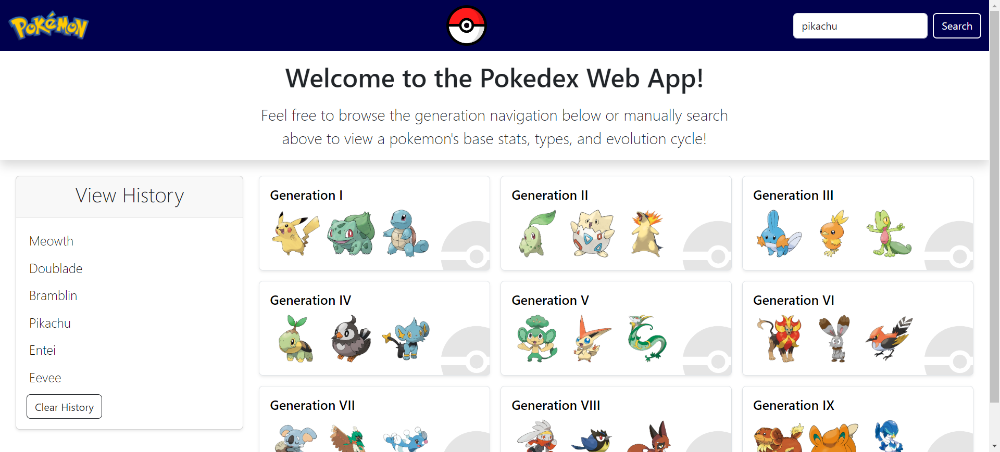

# pokedex-webapp

## Description

The Pokédex Webapp project provides a fun and convenient way to view Pokémon information as it pertains to the video game series with just the click of a few buttons or by a search entry. The user is able to browse through the generations to find the pokemon they would like to view, or manually search the pokemon by name. Once a pokemon is found and selected, the user is presented with a page that displays that Pokémon’s picture, name, stats, types, and evolution cycle. The application was built to have a simple, responsive UI using the core front-end technologies (HTML, CSS, and Javascript) and the Bootstrap framework. Pokemon data is obtained through the PokeAPI.

**Some pokemon do not appear in search results as the API did not contain information for these pokemon. This also causes in error in the display of the pokemon's evolution cycle if one of the pokemon listed below is part of that cycle:

Deoxys, Giratina, Shaymin, Wormadam, Basculin, Darmanitan, Keldeo, Landorus, Meloetta, Thundurus, Tornadus, Aegislash, Gourgeist, Meowstic, Pumpkaboo, Zygarde, Lycanroc, Mimikyu, Minior, Oricorio, Wishiwashi, Basculegion, Eiscue, Enamorus, Indeedee, Morpeko, Toxtricity, Urshifu.

## Installation

N/A

## Usage

The home page presents the user with an interactive UI in which they can either search for a pokemon by name in the search bar or via the generations tabs. Once a pokemon is selected, an information page is then presented with the pokemon's image, name, stats, types, and evolution cycle. If navigated back to the homepage, the user will be able to see all previously viewed pokemon in the "View History" section where the pokemon can be clicked again and the user re-presented with the info page for that pokemon. The View History section is also accessible on smaller screen sizes as a clickable button found near the top of the page.

## Credits

Design of site was inspired by the official pokemon website https://www.pokemon.com/us and other resources found online.